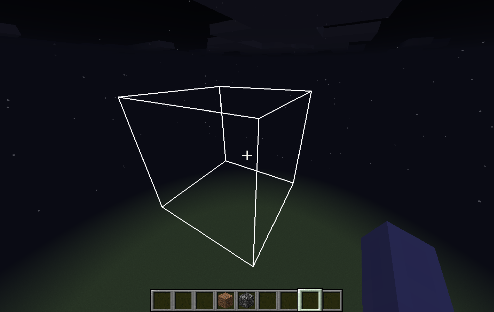

## EG1
Render a wired cube

```java
@SubscribeEvent
public static void onRenderWorldLast(RenderWorldLastEvent event)
{
    EntityPlayerSP player = Minecraft.getMinecraft().player;
    if (player == null) return;
    
    storeCommonGlStates();

    GL11.glPushMatrix();

    GlStateManager.disableCull();
    GlStateManager.enableDepth();
    GlStateManager.disableTexture2D();
    GlStateManager.disableLighting();
    GlStateManager.disableBlend();

    double playerX = player.lastTickPosX + (player.posX - player.lastTickPosX) * event.getPartialTicks();
    double playerY = player.lastTickPosY + (player.posY - player.lastTickPosY) * event.getPartialTicks();
    double playerZ = player.lastTickPosZ + (player.posZ - player.lastTickPosZ) * event.getPartialTicks();

    // minus camera pos and then plus target pos
    // target pos here: 0, 100, 0
    GlStateManager.translate(-(float)(playerX), -(float)(playerY) + 100f, -(float)(playerZ));
    GlStateManager.scale(10f, 10f, 10f);

    GlStateManager.glLineWidth(3f);

    Tessellator tessellator = Tessellator.getInstance();
    BufferBuilder buffer = tessellator.getBuffer();

    buffer.begin(GL11.GL_LINES, DefaultVertexFormats.POSITION_COLOR);

    double size = 1f;

    buffer.pos(0f, 0f, 0f).color(1f, 1f, 1f, 1f).endVertex();
    buffer.pos(size, 0f, 0f).color(1f, 1f, 1f, 1f).endVertex();
    buffer.pos(size, 0f, 0f).color(1f, 1f, 1f, 1f).endVertex();
    buffer.pos(size, size, 0f).color(1f, 1f, 1f, 1f).endVertex();

    buffer.pos(size, size, 0f).color(1f, 1f, 1f, 1f).endVertex();
    buffer.pos(0f, size, 0f).color(1f, 1f, 1f, 1f).endVertex();
    buffer.pos(0f, size, 0f).color(1f, 1f, 1f, 1f).endVertex();
    buffer.pos(0f, 0f, 0f).color(1f, 1f, 1f, 1f).endVertex();

    buffer.pos(0f, 0f, size).color(1f, 1f, 1f, 1f).endVertex();
    buffer.pos(size, 0f, size).color(1f, 1f, 1f, 1f).endVertex();

    buffer.pos(size, 0f, size).color(1f, 1f, 1f, 1f).endVertex();
    buffer.pos(size, size, size).color(1f, 1f, 1f, 1f).endVertex();

    buffer.pos(size, size, size).color(1f, 1f, 1f, 1f).endVertex();
    buffer.pos(0f, size, size).color(1f, 1f, 1f, 1f).endVertex();

    buffer.pos(0f, size, size).color(1f, 1f, 1f, 1f).endVertex();
    buffer.pos(0f, 0f, size).color(1f, 1f, 1f, 1f).endVertex();

    buffer.pos(0f, 0f, 0f).color(1f, 1f, 1f, 1f).endVertex();
    buffer.pos(0f, 0f, size).color(1f, 1f, 1f, 1f).endVertex();

    buffer.pos(size, 0f, 0f).color(1f, 1f, 1f, 1f).endVertex();
    buffer.pos(size, 0f, size).color(1f, 1f, 1f, 1f).endVertex();

    buffer.pos(size, size, 0f).color(1f, 1f, 1f, 1f).endVertex();
    buffer.pos(size, size, size).color(1f, 1f, 1f, 1f).endVertex();

    buffer.pos(0f, size, 0f).color(1f, 1f, 1f, 1f).endVertex();
    buffer.pos(0f, size, size).color(1f, 1f, 1f, 1f).endVertex();

    tessellator.draw();

    GL11.glPopMatrix();

    restoreCommonGlStates();
}
```


> Try toggle off/on each state and see how things change.

Drawing 2D/3D objects using the fixed-func pipeline is generally considered easy, but
less powerful, less streamlined, and _boring_.

Here are the issues of the code snippet above.<br><br>
**GL Level**:
- Pipeline stall due to state fetching (read "_GL States Related Concerns_" for details)
- Potential write-after-read hazard

**Design Level**:
- Global singleton `Tessellator` access which blurs phase restrictions
- Redundant buffer building in every frame while the geometry is fixed
- Render code can't be reordered/composed
- Immediate mode thinking which is bad when it comes to a large scale scene
