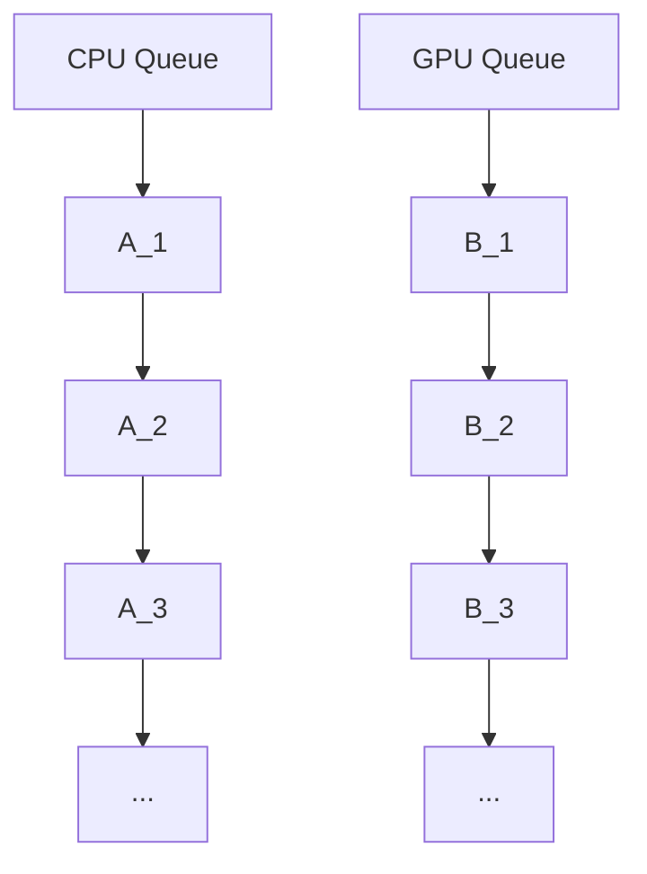

This part is going to help you to form an idea of how GL commands work.

## Command Data Flow
You can think of a queue of commands to be executed for both CPU and GPU.

> **Notice**:<br>
> OpenGL doesn’t expose queues like Vulkan.
> This is only meant to help you understand.



**Quick mental model check**:
- Can I expect `B_2` to perceive `A_1`? like, can I access data from `A_1` safely when running `B_2`?
  > No. `A_1` may run after `B_2`; the data is not safe.
- CPU commands come from Java code, but where do GPU commands come from?
  > Java code still. Your GL code like `GL11.doSomething()` to be exact.
- Code snippet:
  ```java
  GL11.draw();
  func();
  ```
  What does `GL11.draw()` do? Is it going to be executed before `func()` or after?
  > `GL11.draw()` adds a GPU-side command to the command buffer (or say _the GPU queue_)
  > <br>The action of enqueueing a command is going to be executed before `func()`, _**but**_
  > the actual GPU-side action can be executed before OR after `func()`

<br>

> **Key point**:<br>
> CPU and GPU timing mismatches.

However, at the end of every frame, a special command `swap` is going to be executed, which
acts as an implicit sync point. Note that latency can still accumulate.

Command `swap` itself moves content from framebuffer A to framebuffer B (not necessarily memory copy) and display it to the screen,
so we are free to write to framebuffer A while displaying B (not necessarily immediately displaying B; controlled by vsync).

**Quick mental model check**:
- Code snippet:
  ```java
  GL11.drawA();
  GL11.drawB();
  ```
  Is the actual draw command `B` going to be run after `A`?
  > Yes. See below
  > ```mermaid
  > graph TD
  >    B[GPU Queue]
  >    B --> B1[Draw A]
  >    B1 --> B2[Draw B]
  > ```
- Code snippet:
  ```java
  GL11.computeA(); // compute some data on GPU and store in buffer A
  GL11.computeB(); // read buffer A
  ```
  Is the data safe?
  > Unfortunately, no. You must insert a GL `barrier` to guarantee the data visibility.
  > Although the GPU command order is respected, GPU execution order isn't equivalent to memory visibility.
  > <br><br>**Note**:<br>
  > Memory barrier is not a global synchronization indicator.
