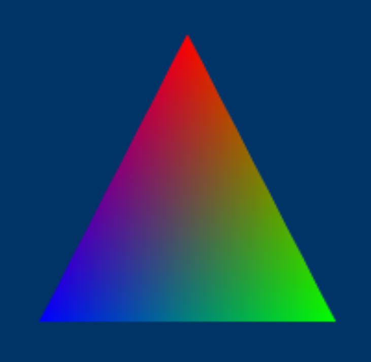
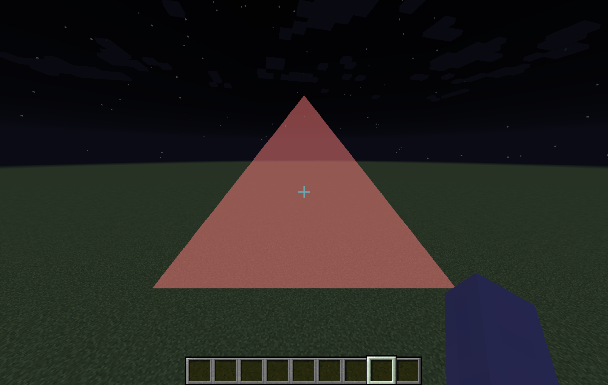

## Shaders
These three lines are exactly how we create a shader.
```java
int shaderID = GL20.glCreateShader(GL20.GL_VERTEX_SHADER or GL20.GL_FRAGMENT_SHADER);
// shaderSource is a string
GL20.glShaderSource(shaderID, shaderSource);
GL20.glCompileShader(shaderID);
```

And the code below tells you the status of your shader.
```java
if (GL20.glGetShaderi(shaderID, GL20.GL_COMPILE_STATUS) == GL11.GL_FALSE)
    String errorLog = GL20.glGetShaderInfoLog(shaderID, 1024);
```

However, having a `shaderID` is not enough. We want a shader program.
We will attach a vertex shader and a fragment shader to the shader program, defining the rendering pipeline.

If you are wondering what are vertex and fragment shaders, take a look at the picture below.

> source: https://www.researchgate.net/figure/The-graphics-pipeline-in-OpenGL-consists-of-these-5-steps-in-the-new-generation-of-cards_fig1_235696712

All you need to know is that `Frag` is a shading stage after `Vert`, and we can pass data from the vertex shader (VS)
to the fragment shader (FS). For instance, we pass the texture UV (e.g. `vec2`) from VS to FS.

You might be wondering how come FS is able to draw a compact region with discrete data.
Answer: interpolation.

Say A=(x1, y1), B=(x2, y2), C=(x3, y3),
then P = λ1`*`A + λ2`*`B + λ3`*`C where Σλi=1, and P is in ABC.

And this is how you get the colorful "_hello triangle_"


## Shader Program
Don't forget to attach both vertex and fragment shader id.
```java
int programID = GL20.glCreateProgram();
GL20.glAttachShader(programID, shaderID);
GL20.glLinkProgram(programID);
```
When you want to use the shader program.
```java
GL20.glUseProgram(programID);

// pass uniforms to the shader

// render

GL20.glUseProgram(0); // 0 stands for "no shader"/"null shader"
```
What are uniforms?
Let's say you have a line of code `uniform bool flag;` in your shader.
Then, you'll need to do the following.
```java
int loc = GL20.glGetUniformLocation(programID, "flag");
GL20.glUniform1i(1 or 0); // which is true or false
```
After that, the `flag` in your shader is set to `true` or `false`.

> **Notice**: 
> - You can only pass uniforms when you are using that shader program
> - Unused uniforms will most likely be deleted by GL so `glGetUniformLocation` will return `-1` (depends on driver)

## Disposing Shaders
You better dispose all the GL related resources at the end.
```java
GL20.glDetachShader(programID, shaderID);
GL20.glDeleteShader(shaderID);
GL20.glDeleteProgram(programID);
```

## EG1
We'll write the actual shaders we used in [Drawing Tris Using Vertices and Indices Via The Modern Pipeline](draw_vertices.md) here.

**Vertex shader**
```glsl
#version 330 core

layout (location = 0) in vec3 pos;
layout (location = 1) in vec2 texCoord;
layout (location = 2) in vec3 normal;

out vec2 TexCoord;
out vec3 FragNormal;

void main()
{
    gl_Position = vec4(pos, 1.0);

    TexCoord = texCoord;
    FragNormal = normal;
}
```

**Fragment shader**
```glsl
#version 330 core

out vec4 FragColor;

void main() 
{
    // tex coord isn't used for simplicity
    // you need to pass a uniform (`uniform sampler2D tex;`) and fetch pixels from tex
    FragColor = vec4(1.0, 0.5, 0.2, 1.0);
}
```



> As we can see, the geometry is totally defined by `gl_Position`. But why is it a `vec4`?<br><br>
> Just a quick clarification, `gl_Position` is in clip space, and it's a 4D homogenous coordinate.

> Vertices like `-0.5f, -0.5f, 0.0f` are small numbers, but why the triangle is huge?<br><br>
> Another quick clarification, those vertices are in NDC (normalized device coordinate)
>
>  | Space | Range | What it Means                       |
>  |:------|:------|:------------------------------------|
>  | NDC X | -1    | Left edge of the viewport           |
>  | NDC X | 1     | Right edge of the viewport          |
>  | NDC Y | -1    | Bottom edge of the viewport         |
>  | NDC Y | 1     | Top edge of the viewport            |
>  | NDC Z | -1    | Near clipping plane (closest depth) |
>  | NDC Z | 0     | Middle of the depth range           |
>  | NDC Z | 1     | Far clipping plane (farthest depth) |
> 
> Usually vertices are transformed from world space to clip space in the vertex shader.
> The GPU then performs perspective division to obtain NDC (`NDC = clip/clip.w`), followed by viewport transform and rasterization.
> Finally, FS receives interpolated attributes, not NDC coordinates.
