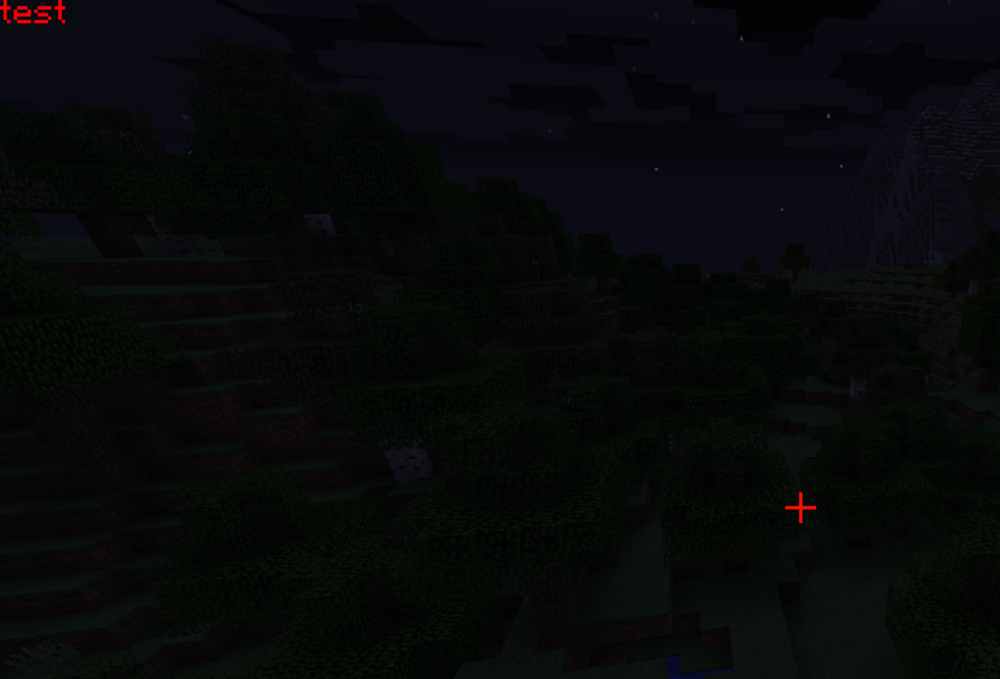
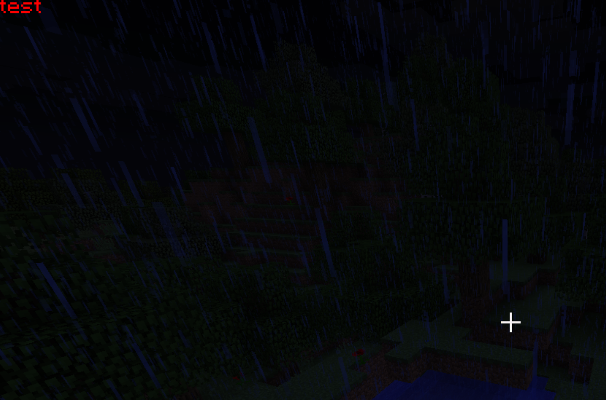
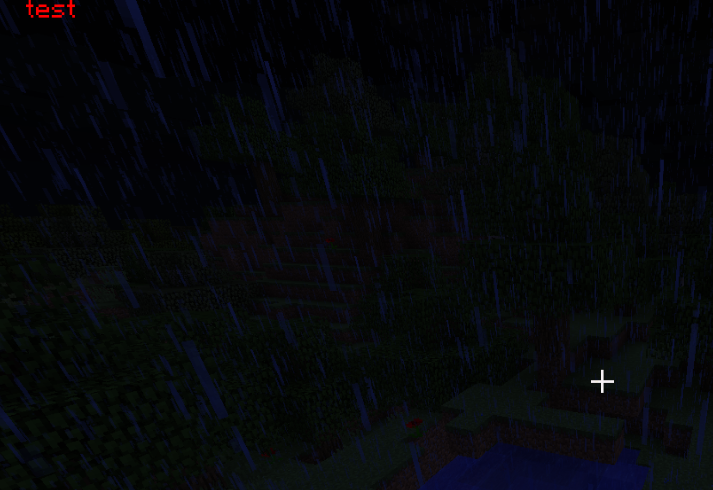
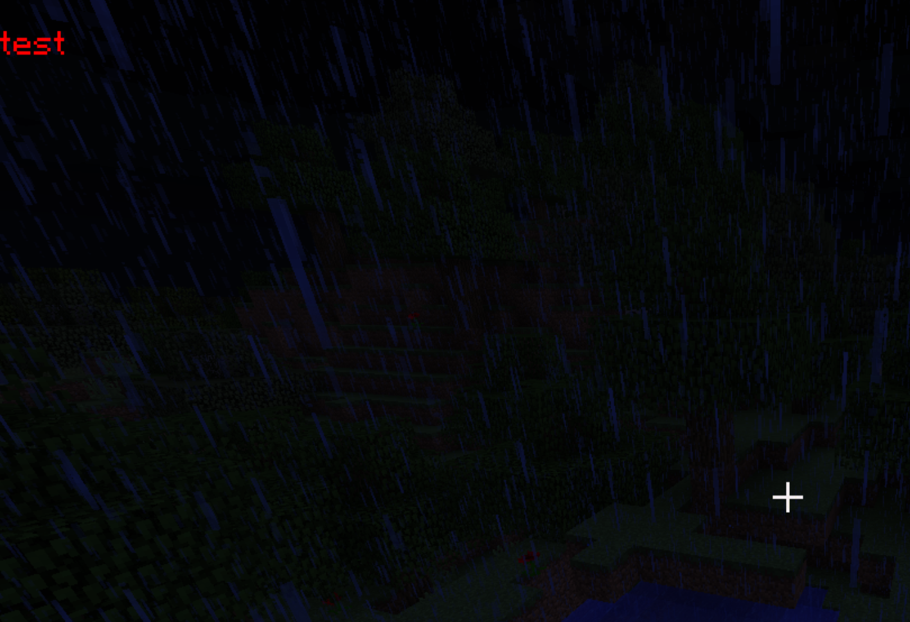
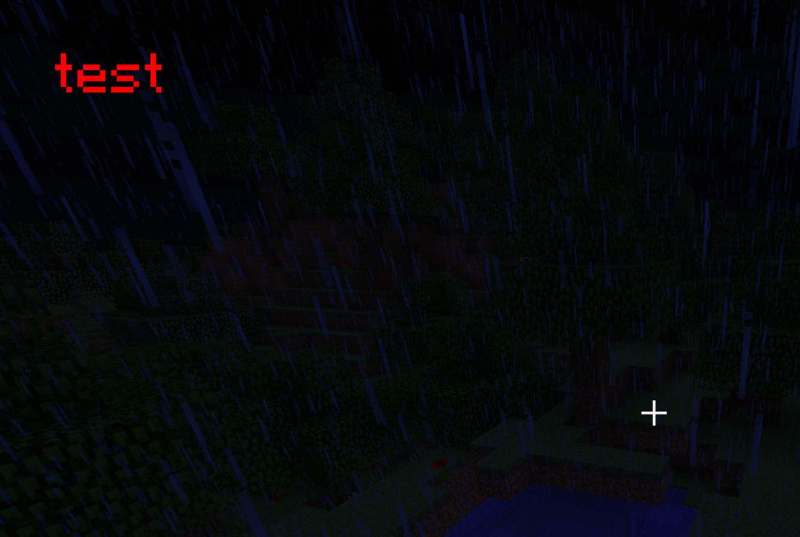
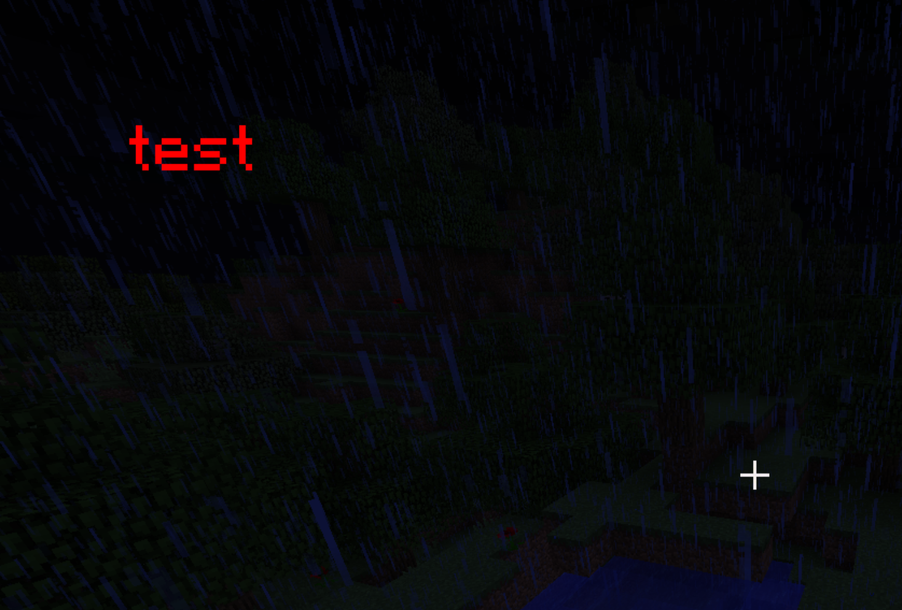

## EG1
Draw a text/string

> This is under Minecraft context. Don't forget to register event listeners.

> `RenderGameOverlayEvent` is generally considered as a good entry point for screen space HUD rendering.

```java
@SubscribeEvent
public static void onRenderGameOverlay(RenderGameOverlayEvent event)
{
    Minecraft.getMinecraft().fontRenderer.drawString("test", 0, 0, Color.RED.getRGB());
}
```


- The default rendering pivot is the top-left corner
- GL is a state machine so the color change affects the crosshair

> **Notice**:<br>
> Another major reason why GL state leaks here is that Minecraft's `FontRenderer` is based on the 
> fixed-func pipeline that heavily relies on GL states.<br>
> If you implemented a font renderer via shaders (i.e. programmable pipeline),
> it'll be much safer "states" wise, but the current bounded shader program is
> also a state, so...

***

## EG2
Draw a string with state leakage handled

```java
FloatBuffer floatBuffer = ByteBuffer.allocateDirect(16 << 2).order(ByteOrder.nativeOrder()).asFloatBuffer();

GL11.glGetFloat(GL11.GL_CURRENT_COLOR, floatBuffer);
float r = floatBuffer.get(0);
float g = floatBuffer.get(1);
float b = floatBuffer.get(2);
float a = floatBuffer.get(3);
        
Minecraft.getMinecraft().fontRenderer.drawString("test", 0, 0, Color.RED.getRGB());

GlStateManager.color(r, g, b, a);
```


- Avoid the state leakage by recording the value and restoring it

> **Notice:**
> - LWJGL3 provides `MemoryStack` to get temporary byte buffers so you don't have to allocate and
>   maintain one by yourself
> - LWJGL3 provides `GL11C` to allow easier state queries: you can pass a `int[]` instead
> - Never allocate byte buffers in hotpaths (slow!)
> - Don't forget to set order to `nativeOrder` (aka CPU endianness)
> - `ByteBuffer.asFloatBuffer()` points to the same slice of memory

***

## EG3
Changing `x`

```java
Minecraft.getMinecraft().fontRenderer.drawString("test", 10, 0, Color.RED.getRGB());
```


- X-axis is like our normal x-axis

***

## EG4
Changing `y`

```java
Minecraft.getMinecraft().fontRenderer.drawString("test", 0, 10, Color.RED.getRGB());
```


- Y-axis is upside down

***

## EG5
Transformation

```java
// push the transformation matrix
GlStateManager.pushMatrix();
GlStateManager.translate(20, 20, 0);
GlStateManager.scale(2, 2, 0);
Minecraft.getMinecraft().fontRenderer.drawString("test", 0, 0, Color.RED.getRGB());
// pop the transformation matrix
GlStateManager.popMatrix();
```



- We want to use `pushMatrix` & `popMatrix` to define the scope of transformation first
- And this is how `scale` & `translate` work

***

## EG6
Transformation order

```java
GlStateManager.pushMatrix();
// notice the order of `scale` and `translate`
GlStateManager.scale(2, 2, 0);
GlStateManager.translate(20, 20, 0);
Minecraft.getMinecraft().fontRenderer.drawString("test", 0, 0, Color.RED.getRGB());
GlStateManager.popMatrix();
```



- The `test` moves further because we apply the `x2 scale` first
- Be careful with the order of `scale` calls

