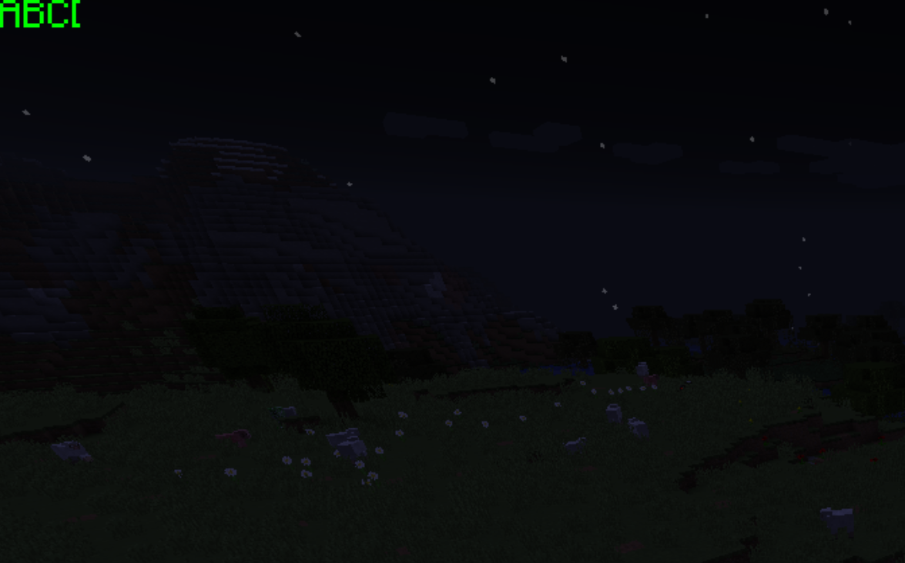
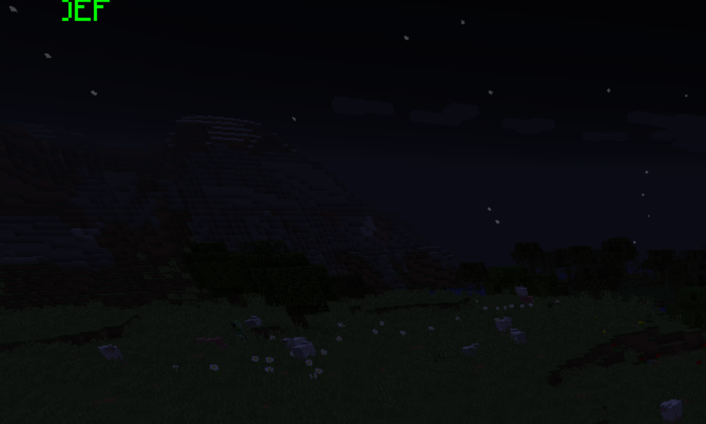

## EG1
Create a mask

```java
@SubscribeEvent
public static void onRenderGameOverlay(RenderGameOverlayEvent event)
{
    if (!Minecraft.getMinecraft().getFramebuffer().isStencilEnabled())
        Minecraft.getMinecraft().getFramebuffer().enableStencil();

    GlStateManager.disableTexture2D();
    GlStateManager.disableCull();
    
    GL11.glEnable(GL11.GL_STENCIL_TEST);

    // can be 0 to 255 (typically when using D24S8)
    int stencilValue = 1;
    // disable depth mask for now cuz we don't want stencil area to pollute depth bits
    GlStateManager.depthMask(false);
    GlStateManager.colorMask(false, false, false, false);
    // stencil controller: stencilFunc + stencilOp
    GL11.glStencilFunc(GL11.GL_ALWAYS, stencilValue, 0xFF);
    GL11.glStencilOp(GL11.GL_REPLACE, GL11.GL_REPLACE, GL11.GL_REPLACE);

    // mask area: turn on all 8 bits for write access
    GL11.glStencilMask(0xFF);

    int x = 0, y = 0, width = 20, height = 20;
    GL11.glBegin(GL11.GL_QUADS);
    GL11.glVertex2f(x, y);
    GL11.glVertex2f(x + width, y);
    GL11.glVertex2f(x + width, y + height);
    GL11.glVertex2f(x, y + height);
    GL11.glEnd();

    // turn off all 8 bits
    GL11.glStencilMask(0x00);
    
    // stencil bits have now been written to the attachment
    // we'll use these bits to control the later UI rendering

    GlStateManager.depthMask(true);
    GlStateManager.colorMask(true, true, true, true);
    // i'll change this line for the next example
    GL11.glStencilFunc(GL11.GL_EQUAL, stencilValue, 0xFF);
    GL11.glStencilOp(GL11.GL_KEEP, GL11.GL_KEEP, GL11.GL_KEEP);

    GlStateManager.enableTexture2D();
    GlStateManager.enableCull();

    // draw
    Minecraft.getMinecraft().fontRenderer.drawString("ABCDEF", 0, 0, Color.GREEN.getRGB());

    GL11.glDisable(GL11.GL_STENCIL_TEST);
}
```


- This is an example of masking a text to a 20x20 area

> **Notice:**
> The framebuffer you are using must support stencil (a `D24S8` format depth attachment is usually wanted),
> and it also explains why a dedicated framebuffer is preferred for UI elements.

***

## EG2
How do we change the behavior of a mask?

```java
GL11.glStencilFunc(GL11.GL_NOTEQUAL, stencilValue, 0xFF);
```


- This is how `glStencilFunc` works so we get an anti-masked text

> All you can do with stencil is playing with `stencilFunc + stencilOp` and
> also stencil bits manipulations.

## EG3

Here's an example of creating a stencil system that supports nested masks.

```java
public final class RenderMask
{
    private static final Stack<RenderMask> maskStack = new Stack<>();
    private static int stencilValueCounter = 1;
    private static int nextStencilValue()
    {
        stencilValueCounter++;
        if (stencilValueCounter > 254)
        {
            stencilValueCounter = 2;
            GL11.glClearStencil(0);
            GL11.glClear(GL11.GL_STENCIL_BUFFER_BIT);
        }
        return stencilValueCounter;
    }
    
    public static void resetStencil()
    {
        GL11.glClearStencil(0);
        GL11.glClear(GL11.GL_STENCIL_BUFFER_BIT);
        stencilValueCounter = 1;
    }

    public enum MaskShape
    {
        RECT,
        ROUNDED_RECT,
        CUSTOM
    }

    public MaskShape maskShape;
    private final Map<MaskShape, Boolean> init = new HashMap<>();

    private final int stencilValue;
    private float x;
    private float y;
    private float width;
    private float height;
    private float radius;
    private Action drawMask;

    public RenderMask(MaskShape maskShape)
    {
        this.maskShape = maskShape;
        init.put(MaskShape.RECT, false);
        init.put(MaskShape.ROUNDED_RECT, false);
        init.put(MaskShape.CUSTOM, false);
        stencilValue = nextStencilValue();
    }

    public void setRectMask(float x, float y, float width, float height)
    {
        init.put(MaskShape.RECT, true);
        this.x = x;
        this.y = y;
        this.width = width;
        this.height = height;
    }
    
    public void setRoundedRectMask(float x, float y, float width, float height, float radius)
    {
        init.put(MaskShape.ROUNDED_RECT, true);
        this.x = x;
        this.y = y;
        this.width = width;
        this.height = height;
        this.radius = radius;
    }
    
    public void setCustomMask(Action drawMask)
    {
        init.put(MaskShape.CUSTOM, true);
        this.drawMask = drawMask;
    }

    private static void drawStencilArea(RenderMask mask)
    {
        switch (mask.maskShape)
        {
            case RECT ->
            {
                if (mask.init.get(MaskShape.RECT))
                    RenderUtils.drawRectStencilArea(mask.x, mask.y, mask.width, mask.height);
            }
            case ROUNDED_RECT ->
            {
                if (mask.init.get(MaskShape.ROUNDED_RECT))
                    RenderUtils.drawRoundedRectStencilArea(mask.x, mask.y, mask.width, mask.height, mask.radius);
            }
            case CUSTOM ->
            {
                if (mask.init.get(MaskShape.CUSTOM))
                    if (mask.drawMask != null)
                        mask.drawMask.invoke();
            }
        }
    }

    public void startMasking()
    {
        if (maskStack.isEmpty())
            maskStack.push(this);
        else if (maskStack.peek() != this)
            maskStack.push(this);

        RenderUtils.prepareStencilToWrite(stencilValue);
        drawStencilArea(this);

        if (maskStack.size() > 1)
        {
            ListIterator<RenderMask> iterator = maskStack.listIterator(maskStack.size());
            iterator.previous();
            while (iterator.hasPrevious())
            {
                RenderMask prevMask = iterator.previous();
                RenderUtils.prepareStencilToIncrease(stencilValue);
                drawStencilArea(prevMask);
                RenderUtils.prepareStencilToZero(stencilValue);
                drawStencilArea(this);
                RenderUtils.prepareStencilToDecrease(stencilValue + 1);
                drawStencilArea(this);
            }
        }

        RenderUtils.prepareStencilToRender(stencilValue);
    }
    
    public static void endMasking()
    {
        RenderUtils.endStencil();
        maskStack.pop();
        if (!maskStack.isEmpty())
            maskStack.peek().startMasking();
    }
}
```

Usage:
```java
RenderMask a;
RenderMask b;

a.startMasking();
b.startMasking();
// draw
b.endMasking();
a.endMasking();
```

This code snippet doesn't aim to work like an ultimate masking solution,
but `startMasking` & `endMasking` do explain how we can play with stencil bits
to get sophisticated effects.
